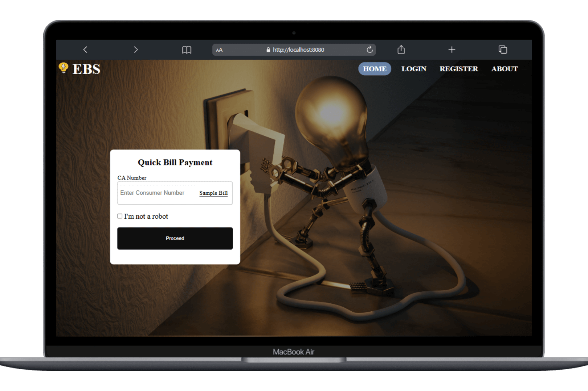

<h1 align="center">
  ⚡ Electricity Billing System 
  <a href="#" target="_blank">Live Demo</a>
</h1>

  

## About

### 📖 Comprehensive Web-Based Electricity Billing Solution  

### 🌟 Features:
- **🔹 Admin & Consumer Management** – Seamless handling of users, roles, and access control.  
- **📜 Bill Generation & Payment** – Automatic bill calculations and Quick bill payment.  
- **🔌 Connection Management** – Track and manage new and existing electricity connections.  
- **🛡️ Secure User Authentication** – Role-based access for admins and consumers.  
- **📊 Usage & Billing History** – Consumers can view past bills and payment records.  

### 🛠️ Technologies Used:
- **Backend:** `Java`, `Spring MVC`, `Hibernate`, `JSP`
- **Frontend:** `HTML`, `CSS`, `JavaScript`
- **Database:** `MySQL`  
- **Security:** `Spring Security`

🚀 *A powerful and efficient solution to streamline electricity billing and management!*  

## Getting Started

### 📥 Clone the Repository  
You will need **Git** and **MySQL** installed on your machine.

### 🛠 Installation and Setup Instructions

1. Run `EBS-Schema.sql` file in MySQL workbench
2. Set environement variables mentioned in the `docker-compose.yml` file
3. Run the application
4. The Default admin user will get created for the first time with userId `0000000001` and password `def@7890`, use it for login

